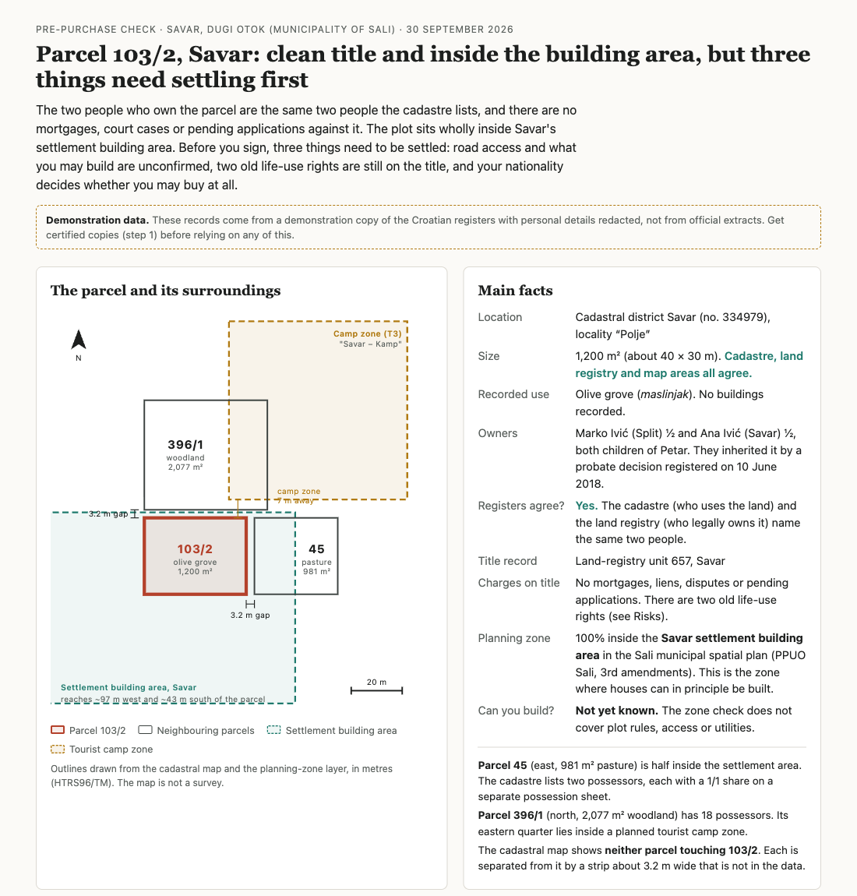

# Croatian Cadastral API Client

Read the cadastre, the land registry and the spatial plans from a terminal, from
Python, or from an AI assistant. Look up a parcel, see who owns it, read the land
registry unit with its encumbrances and pending entries, check whether the parcel
lies in a building area, and export parcel boundaries for GIS tools.

> **Demonstration project with practice data.** This repository shows how a modern
> cadastral API could work. It ships with a mock server, and every example here runs
> against it. Before pointing it at any other server, including the official Croatian
> cadastre, land registry and spatial-plan services, verify that you have the rights
> to use that server and its data (terms of service, data protection). You do so at
> your own risk. Full terms in [docs/legal.md](docs/legal.md).

Requires Python 3.12 or newer.

## Ask in plain language

Connect the MCP server to Claude Code (or any MCP client) and ask the way you
would ask a colleague. With the tool installed and the practice server running
(see [Get started](#get-started)), from the activated environment:

```bash
claude mcp add cadastral -e CADASTRAL_API_BASE_URL=http://localhost:8000 \
  -- "$(which cadastral-mcp)" --transport stdio
```

The answers below are Claude Code's, against the practice data, shortened.

### Example 1: Look up a parcel in the cadastre

> **You:** What is parcel 396/1 in Savar?
>
> **Claude:** Parcel 396/1 in the cadastral municipality of Savar is a 2,077 m²
> plot of forest at the location called "Ilo", with no buildings and no
> building right. The cadastre lists 18 co-possessors, 11 of them in Savar and
> the rest in Zadar and Split, with no shares given. The cadastre and the land
> registry are marked as aligned; the parcel is in land registry unit 645.
>
> Possessors are not owners: these names come from the cadastre, and the
> registered owners in the land registry can be different people. I can look
> them up if you want them. …

### Example 2: Check several parcels against the spatial plans

> **You:** Which of parcels 103/2, 45 and 396/1 in Savar are in a building area?
>
> **Claude:** All three touch a building area, but only 103/2 lies wholly
> inside one.
>
> | Parcel | Area | Building area | Share inside |
> |---|---|---|---|
> | 103/2 | 1,200 m² | Savar settlement | 100% |
> | 45 | 981 m² | Savar settlement | 50% |
> | 396/1 | 2,077 m² | Tourist camp zone outside the village | 27% |
>
> All three zones come from the Sali municipal spatial plan. This doesn't say
> whether you can build: it doesn't check the plan's detailed rules, minimum
> plot size, road access or protection regimes. The building-area layer is the
> county planning institutes' reading of the plans and may differ from the
> plans in force. …

### Example 3: Combine all three sources before a purchase

> **You:** I'm thinking of buying parcel 103/2 in Savar. Check the cadastre, the
> land registry and the spatial plan and tell me what I should know.
>
> **Claude:** Parcel 103/2 looks like a fairly clean purchase, with one real
> thing to deal with before you sign: two old usufruct rights still registered
> against the land.
>
> **Cadastre.** 1,200 m² olive grove at "Polje", no buildings. The cadastre, the
> land registry and the map drawing give the same area.
>
> **Land registry (Savar main book, unit 657).** Ivić Marko and Ivić Ana own
> half each, registered in 2018. They are the same people the cadastre shows
> using the land, though the match is by name only: no tax numbers (OIB) are
> recorded. No pending applications, no mortgages, no enforcement.
>
> **What needs attention.** Two usufructs, rights to use the land and keep what
> it produces: one for Ivić Marija from 1949, lasting until she marries, and one
> for Ivić Jela over a 2/6 share from 1979. Both are personal and end with the
> holder's death, so they have very likely lapsed, but they stay on the register
> until someone applies to delete them. Make their deletion a condition of the
> contract.
>
> **Spatial plan.** The whole parcel lies inside the Savar settlement building
> area under the Sali municipal spatial plan. That is a good sign, not a
> confirmation that you can build: ask the municipality for a location
> information certificate (*lokacijska informacija*).
>
> **Before you sign.** Get fresh official extracts, have the usufructs deleted,
> make sure both co-owners sign and check their OIBs, check road access, and
> have a lawyer or notary review the contract. …

### Example 4: Get a one-page report with a map

> **You:** I'm a foreign investor thinking of buying parcel 103/2 in Savar.
> Check the cadastre, the land registry and the spatial plan, and make me a
> one-page report in plain English as report.html: a map of the parcel with its
> neighbours 45 and 396/1 and the building areas around them (outlines only, no
> base map tiles), the main facts, the risks, and what to do next.

Claude Code draws the map from the parcel and zone outlines the tools return,
and writes the report around it. The top of it is below; the risks and next
steps are in the [full page](docs/images/parcel-report-full.png).

[](docs/images/parcel-report-full.png)

For Claude Desktop, ChatGPT and a hosted server, see the
[MCP usage guide](docs/mcp-usage-guide.md).

## From the terminal and from Python

**From the terminal.** One line from a parcel number to owners, parcels,
encumbrances, and pending entries (plombe):

```bash
cadastral get-lr-unit --from-parcel 103/2 -m SAVAR --all --plombe-detail
```

The same program answers to `uz` with Croatian command names, so
`uz čestica 103/2 -ko SAVAR` works too. Output samples are on the
[get-lr-unit page](docs/en/cli/commands/get-lr-unit.md).

**From Python.**

```python
from cadastral_api import CadastralAPIClient

with CadastralAPIClient() as client:
    unit = client.get_lr_unit_from_parcel("103/2", "SAVAR")
    for owner in unit.get_all_owners():
        print(owner.name)
    if unit.has_pending_plombe():
        print("A change is pending on this unit")
```

## What you can do

| Task | CLI | Read more |
|---|---|---|
| Find a parcel and its basic data | `cadastral search` | [search](docs/en/cli/commands/search.md) |
| Everything the cadastre holds, with possessors | `cadastral get-parcel --show-owners` | [get-parcel](docs/en/cli/commands/get-parcel.md) |
| Land registry unit: owners, parcels, encumbrances | `cadastral get-lr-unit --all` | [get-lr-unit](docs/en/cli/commands/get-lr-unit.md) |
| Pending entries (plombe), resolved to what each one is about | `--plombe-detail` | [get-lr-unit](docs/en/cli/commands/get-lr-unit.md) |
| Condominiums (etažno vlasništvo), unit by unit | `cadastral get-lr-unit --show-owners` | [glossary](docs/en/cli/glossary.md) |
| Is the cadastre in step with the land registry? | shown on every parcel and unit | [get-parcel](docs/en/cli/commands/get-parcel.md) |
| Many parcels, then many units, in one pipeline | `cadastral get-parcel --detail registry`, `get-lr-unit --input` | [get-parcel](docs/en/cli/commands/get-parcel.md), [get-lr-unit](docs/en/cli/commands/get-lr-unit.md) |
| Parcel boundaries as WKT or GeoJSON, offline GIS download | `cadastral get-geometry`, `download-gis` | [get-geometry](docs/en/cli/commands/get-geometry.md) |
| Spatial plans: is the parcel in a building area, of what kind (tourist zone, settlement) | `cadastral get-zoning` | [get-zoning](docs/en/cli/commands/get-zoning.md) |
| Table, JSON, or CSV output, in Croatian or English | `--format`, `--lang` | [complete reference](docs/en/cli/reference.md) |

Everything the CLI does is also available as Python calls and as MCP tools.

## Get started

```bash
git clone https://github.com/ssarunic/cadastre.git
cd cadastre
python3 -m venv .venv && source .venv/bin/activate
pip install -e ./api -e ./cli -e ./mcp
pip install -r mock-server/requirements.txt

# terminal 1: the practice server
python mock-server/src/main.py

# terminal 2: your first query
cadastral search 103/2 -m SAVAR
```

The full installation page, written for the person setting this up for
someone else, is at [docs/en/cli/install.md](docs/en/cli/install.md).

## Documentation

| For | Start at |
|---|---|
| Using the CLI (English) | [Start here](docs/en/cli/start-here.md), then the [complete reference](docs/en/cli/reference.md) |
| Korištenje alata (hrvatski) | [Vodič za početak](docs/hr/cli/start-here.md), zatim [sve naredbe](docs/hr/cli/reference.md) |
| Using the Python SDK | [SDK guide](docs/sdk-guide.md) |
| Using the MCP server with Claude | [MCP usage guide](docs/mcp-usage-guide.md) |
| Running the mock server | [mock-server/README.md](mock-server/README.md) |
| Developing and releasing | [Development guide](docs/development-guide.md), [CHANGELOG](CHANGELOG.md) |
| Architecture and specifications | [specs/](specs/README.md) |

## License

MIT, for the code. Before using it with any server other than the included
mock, verify that you have the rights to use that server and its data; you do
so at your own risk. See [docs/legal.md](docs/legal.md).
